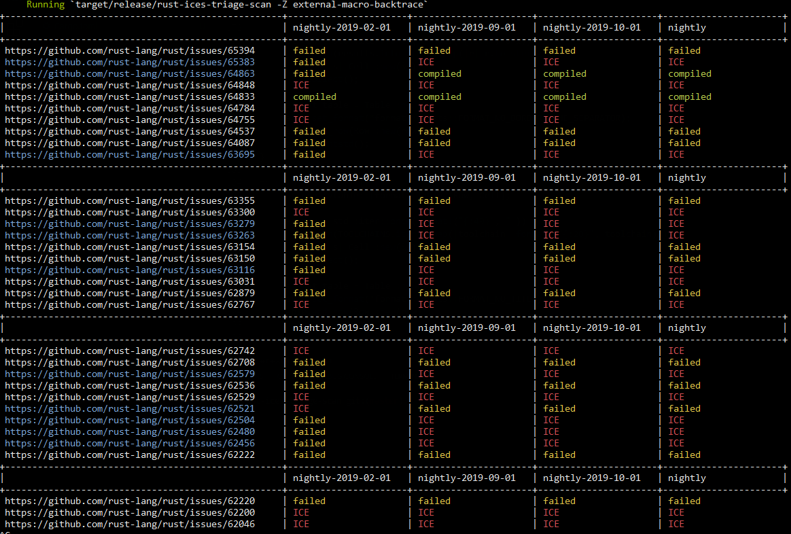

### Running

`cargo run --release`

It will then output a table like this:

The set of toolchain versions is hardcoded here: https://github.com/jakubadamw/rust-ices-triage-scan/blob/master/src/main.rs#L161-L166
